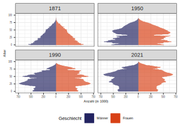
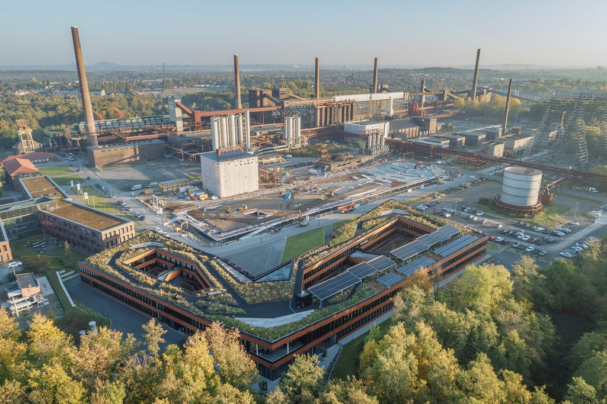
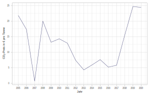

class: title-slide

```{r xaringan-themer, include=FALSE}
library(xaringanthemer)
style_xaringan(text_color = "#232461",inverse_text_color = "#FFFFFF",inverse_background_color = "#232461", title_slide_background_color = "#232461",header_background_color = "#232461",header_color = "#FFFFFF",header_h1_font_size = "32px",
  header_h2_font_size = "26px",link_color="#d84116",
  header_h3_font_size = "20px",text_slide_number_color = "#232461",text_slide_number_font_size = "0.5em")
```

```{r xaringanExtra, echo=FALSE}
xaringanExtra::use_progress_bar(color = "#d84116", location = "bottom")
xaringanExtra::use_xaringan_extra(c("tile_view","scribble","panelset","tachyons"))
xaringanExtra::style_panelset_tabs(font_family = "inherit")
#xaringanExtra::use_search(show_icon = TRUE)
#weitere: "share_again","animate_css", "webcam","freezeframe","clipboard","fit_screen","extra-styles" 
xaringanExtra::use_editable(expires = 1)
xaringanExtra::use_freezeframe(trigger = "hover")
```


```{r setup, include=FALSE}
options(htmltools.dir.version = FALSE)
library(fontawesome)
source(xfun::from_root("lit","helper.R"))
library(RefManageR)
BibOptions(check.entries = FALSE, 
           bib.style = "authoryear", 
           style = "markdown",
           dashed = TRUE)
file.name <- system.file("Bib", 
                         "my_bib.bib", 
                         package = "RefManageR")
bib <- ReadBib(xfun::from_root("lit","my_bib.bib"))
```


# Bestandsmanagement von Projektentwicklungsunternehmen

## Einordnung und aktuelle Trends

### HfWU Nürtingen-Geislingen am 18.12.2023 
<br>
<br>
<br>
<br>
<br>
<br>
<br>
<br>
### Prof. Dr. Jörg Schoder
<br>
.mycontacts[
`r fa('github')` @Schoder
`r fa('linkedin')` @jfschoder
]

---
layout: true

<div class="my-footer"></div>       

<div style="position: absolute;left:400px;bottom:10px;color:ISBAblue;font-size:9px">`r fa('creative-commons')``r rmarkdown::metadata$author`</div>


---
name: motivation
class: left

# Die Stunde der ...

.panelset[
.panel[.panel-name[...Immobilienexperten]
<br>

.blockquote[
In der Niedrigzinsphase fand nahezu jedes Produkt, das auf den Markt kam, schnell zahlreiche Bieter. Die Risikoklassen verwischten, Core-Plus-Produkte gingen mit einem Zwinkern als Core durch, da Investoren davon ausgingen, dass der Wert in jedem Fall steige – wenn man das Asset nur im Bestand hat. Das hat sich binnen weniger Quartale deutlich geändert und **nun schlägt die Stunde der Immobilienexperten**, denn Investoren müssen mit ihrem Bestand arbeiten, um dessen Wert zu sichern.
.tr[
[Jones Lang Lasalle (2023)](https://www.jll.de/de/trends-and-insights/investoren/damit-core-auch-core-bleiben-kann)
]
`r NoCite(bib,"jones_lang_lasalle_damit_2023")`
]

]
.panel[.panel-name[...Projektentwickler (?)]
```{r}
#| echo: false
#| fig-align: 'center'
#| out-width: '60%'
knitr::include_graphics(xfun::from_root('img','Signa_(NZZ_20231123).png'))
```

.quellePanURL[Quelle: [NZZ (23.11.2023).](https://www.nzz.ch/wirtschaft/anter-acinda-ld.1766089)]
]
]


???


* Anspruchsvollere Finanzierungen, ESG-Kriterien sowie Fachkräfte- und Materialmangel am Bau drücken auf die Bilanz. „Hier kommt **strategisches Asset Management** ins Spiel, denn es geht um die **langfristige Ausrichtung einer Immobilie oder eines Portfolios** und nicht mehr allein um eine kompakte Sanierung für den schnellen Verkauf“, sagt Alexandra Meyder-Cyrus, Head of Asset Management bei JLL Germany. 
* Die Dienstleistung hat seine **Funktion somit von einer umsetzenden zu einer strategisch beratenden fortentwickelt**.


---
name: agenda
class: inverse, center, middle

# Das Programm

.blockquote[Teil 1: Projektentwicklungsunternhmen: Markt und Umfeld]

.blockquote[Teil 2: Bestandsmanagement: Trends und Notwendigkeiten]

.blockquote[Teil 3: Diskussion]

---
name: icons
class: left


# 🎓 Lernziele 


🎯 Ich kann das Geschäftsmodell von Projektentwicklungsunternehmen


---
name: teil1
class: inverse, center, middle

# Teil 1: Projektentwicklungsunternehmen 

.blockquote[Begriff und Schnittstellenfunktion]

.blockquote[Schnittstelle Finanz- und Realwirtschaft]

.blockquote[Herausforderungen und Notwendigkeit eines Bestandsmanagements]


---
name: Dev
class: left

# Projektentwicklung und Projektentwickler

.panelset[
.panel[.panel-name[Definition]
.blockquote[
"Durch Projektentwicklungen (im weiteren Sinne)
sind die Faktoren Standort, Projektidee und Kapital
so miteinander zu kombinieren, dass einzelwirtschaftlich
wettbewerbsfähige, Arbeitsplatz schaffende
und sichernde sowie gesamtwirtschaftlich
sozial- und umweltverträgliche Immobilienobjekte
geschaffen und dauerhaft rentabel genutzt werden
können."

.tr[
`r Citet(bib,"diederichs_grundlagen_1994")`, S. 43.
]
]

```{r}
#| echo: false
#| fig-align: 'center'
#| out-width: '62%'
knitr::include_graphics(xfun::from_root('img','PE_statisch.png'))
```
.quellePanURL[Eigene Darstellung nach `r Citet(bib,"diederichs_grundlagen_1994")`, S. 46.]

]
.panel[.panel-name[Phasen]
```{r}
#| echo: false
#| fig-align: 'center'
#| out-width: '90%'
knitr::include_graphics(xfun::from_root('img','PE_Begriffe.png'))
```
.quellePanURL[Quelle `r Citet(bib,"diederichs_bauwirtschaft_2020")`, S. 206.]

]

.panel[.panel-name[Typen]
```{r}
#| echo: false
#| fig-align: 'center'
#| out-width: '100%'
knitr::include_graphics(xfun::from_root('img','PE_Typen.png'))
```

.quellePanURL[Eigene Darstellung.]

]
.panel[.panel-name[Marktstruktur]
```{r}
#| echo: false
#| fig-align: 'center'
#| out-width: '100%'
knitr::include_graphics(xfun::from_root('img','Marktstruktur_Developer_(bulwiengesa_2023).png'))
```

.quellePanURL[Eigene Darstellung.]

]

]

???

Projektentwickler als Bestandhalter?

* Trader-Developer: klassischer Projektentwickler
* Service-Developer: Im Auftrag und auf fremde Rechnung. Wollen wir hier nicht weiter betrachten.
* Wichtig ist an dieser Stelle, dass offensichtlich Investor-Developer entwickelte Objekte selbst halten wollen und daher typisch einen langfristigen Zeithorizont mitbringen.
* Trading-Developers haben zunächst nicht die Absicht, die entwickelten Objekte auch selbst zu halten, aber:
  * sie sind natürlich **temporäre Bestandshalter (Zwischeninvestoren)**.
  * außerdem, kann es in Abhängigkeit von der Marktsituation opportun sein, Objekte zu halten, auch wenn diese nicht von Anfang an so geplant war. Das werden wir uns noch genauer anschauen.


---
name: PEU
class: left

# Projektentwicklung als Schnittstellenfunktion


```{r}
#| echo: false
#| out-width: '65%'
#| fig-align: 'center'
knitr::include_graphics(xfun::from_root('img','PE_Schnittstelle_(Miles_etal).png'))
```

.quelle[Quelle: `r Citet(bib,"miles_real_2015")`, S. 40.]

???

* Projektentwicklung wird nicht selten als Königsdisziplin der Immobilienwirtschaft bezeichnet.
* Interaktion mit zahlreichen Akteuren:
  * Öffentliche Verwaltung (Baurecht etc.)
  * Rechtswesen (Verträge etc.)
  * Finanzsektor 
    * Finanzierung
      * Fremdkapital (Banken (Kredite) bzw. Investmentbanken (Anleihen)
      * Eigenkapital
    * Investoren (Käufer)
      * Immobiliengesellschaften
      * Fonds
      * Öffentliche Hand
      * ...
  * Bau- und Planungssektor
    * Architekten
    * Bauingenieure
    * Bauträger
    * ...
  * Immobiliendienstleister 
    * Vermarktung
    * Vermittlung
    * ...
  * Grundstückseigentümer
  * Mieter/Nutzer
    * Vorverträge in der Regel von Investoren gefordert
  * Öffentlichkeit (Bürger-Partizipation)

    

---
class: left
name: DW

# Schnittstelle Finanzwirtschaft-Realwirtschaft

.panelset[
.panel[.panel-name[Theorie]

```{r}
#| echo: false
#| fig-align: 'center'
#| out-width: '90%'
#| fig-cap: "DiPasquale-Wheaton-Modell"
#| fig-topcaption: true
knitr::include_graphics(xfun::from_root('img','DiPasqualeWheaton.png'))
```

.quellePanURL[Eigene Darstellung.]
]
.panel[.panel-name[Empirie]
```{r vol22,echo=FALSE,out.width='100%',fig.align='center',cache=TRUE}
#| echo: false
#| out-width: '100%'
#| fig-align: 'center'
#| fig-cap: "Investmentvolumen EMEA (bis einschl. Q3/2023)"
#| fig-topcaption: true 
knitr::include_graphics(xfun::from_root('img','Investment_Volumes_Europe_2011-2023_(CBRE_2023).png'))
```

<br>
.quellePanURL[Quelle: [CBRE (2023, S.2).](https://mktgdocs.cbre.com/2299/2ac55914-5b71-4bf0-8049-3130ed63f7c2-2931432956.pdf)]
]
]


???

* DiPasquale/Wheaton-Modell bekannt?
* Würden wir natürlich ausführlich in einer Vorlesung besprechen
* Hier Fokus auf die beiden linken Quadranten.
  * oben links: Asset-Markt. Hier wird vereinfacht gesagt der Kapitalwert der im Mietmarkt (rechts oben) erzielbaren Mietpreis mit der Formel für die Ewige-Rente ermittelt (Wert=Miete/Zinssatz)
  * Der finanzwirtschaftliche Wert für Flächen wird dann mit der Realwirtschaft abeglichen. Kann zum "finanzwirtschaftlich realistischen Verkaufspreis" (dem eben ermittelten Kapitalwert) ein Neubau einzelwirtschaftlich gewinnbringend realisiert werden?

* Schauen wir uns kurz an, was passiert, wenn die Zinsen, also die Opportunitätskosten der Immobilieninvestition, steigen:
  * Dann dreht die Gerade links oben nach rechts, sie wird steiler.
  * Was folgt daraus? Weniger neue Flächen können rentabel entwickelt bzw. gebaut werden.
  
* Das ist was wir ja aktuell beobachten und wir können es noch mit aktuellen Zahlen von CBRE belegen. 
  * Investmentvolumina sind um über 50% zurückgegangen
  * Gilt letztlich über alle Nutzungsformen hinweg.

---
name: attractiveness
class: left

# Attraktivität der "Assetklasse Immobilien"

.panelset[
.panel[.panel-name[Staatsanleihen]
```{r}
#| echo: false
#| fig-align: 'center'
#| out-width: '80%'
knitr::include_graphics(xfun::from_root('img','yieldcurve_Euro.svg'))
```

.quellePanURL[Eigene Darstellung. Datenquelle: [EZB (2023)](https://www.ecb.europa.eu/stats/financial_markets_and_interest_rates/euro_area_yield_curves/html/index.en.html).]
]
.panel[.panel-name[Spitzenrenditen]
```{r}
#| echo: false
#| fig-align: 'center'
#| out-width: '100%'
knitr::include_graphics(xfun::from_root('img','Spitzenrendite_Office_(Colliers_2023).png'))
```
<br>
.quellePanURL[Quelle: [Colliers (2023)](https://citysurvey.colliers.de/investmentmarkt/).]
]
]


???

* Anders ausgedrückt hat die Anlageklasse Immobilien an Attraktivität verloren, weil die lange Niedrigzinsphase zu Ende gegangen ist - oder zumindest unterbrochen wurde.

* Konkret: Immer wieder war in den vergangenen Jahren von TINA die Rede (There is no Alternative). Die global bedeutendste Anlageklasse (Staatsanleihen) war angesichts geringer oder teils gar negativer Zinsen nicht attraktiv.

* AAA-Staatsanleihen Laufzeiten 5-10 Jahre: Anstieg der Renditen um 150-200 Basispunkte

* Büro (Colliers-Daten): Anstieg der Spitzenrendite (=Bruttoanfangsrendite) um 120-150 Basispunkte
* Bulwiengesa-Daten: Netto-Anfangsrenditen in Top7-Städten ca. 100 Basispunkte

* Nachrichtlich Spizenrendite (=Bruttoanfangsrendite) **Logistik** und **Handel**: 4,5%
* Nachrichtlich Spitzenrendite **Wohnen**:
  * stabiles Niveau der Spitzenrendite 
    * 3,85 Prozent für Bestandsobjekte in den Top 7 Städten
    * 4,50 Prozent an anderen Standorten
  * Datenbasis (laut Colliers): lokale Gutachterausschüsse - Preiskorrektur im letzten Jahr in den Top 7 Städten im Durchschnitt bei 25 Prozent. 


---
name: TINA
class: left

# Exkurs: Finanzialisierung und Immobilien-Investments

.panelset[
.panel[.panel-name[Globale Asset Allocation]
```{r}
#| echo: false
#| out-width: '55%'
#| fig-align: 'center'
knitr::include_graphics(xfun::from_root('img','Globale_Asset_Allocation_(ssga).png'))
```
]
.panel[.panel-name[Entwicklung Asset-Gewichtung]
```{r}
#| echo: false
#| out-width: '100%'
knitr::include_graphics(xfun::from_root('img','TINA_(ssga).png'))
```

Literaturtip: `r Citet(bib,"aalbers_financial_2019")`

]
]


.quelle[[State Street Advisory Group (2022).](https://www.ssga.com/library-content/pdfs/global/global-market-portfolio-value-of-investable-assets-touch-all-time-high.pdf)]


???

* Investierbare Märkte, Anteile an der Marktkapitalisierung

* Entwicklung:
  * kontinuierlicher Anstieg des Marktanteils von realen Assets (u.a. Immobilien)
  * Erklärung:
    * TINA? There is no Alternative im Niedrigzinsumfeld (geringe Renditen bei Anleihen)
    * genauer hingeschaut steigt der Marktanteil aber nicht erst seit der Finanzkrise. FINANZIALISIERUNG
    


---
name: Bilanz
class: left

# Konsequenz für Projektentwicklungsunternehmen?


.panelset[
.panel[.panel-name[Erfolgsrechnung]

$$Gewinn = Umsatz - Kosten$$
* Umsatz? `r fa('circle-right')` Druck auf Verkaufspreise
* Kosten? 
  * Baukosten
  * Lohnkosten
  * Kapitalkosten

]
.panel[.panel-name[Bilanz]

```{r}
#| echo: false
#| fig-align: 'center'
#| out-width: '100%'
knitr::include_graphics(xfun::from_root('img','Bilanz.png'))
```
<br>
.quellePanURL[Eigene Darstellung.]
]
.panel[.panel-name[Managementaufgaben]
⚖️ Finanzielles Gleichgewicht

* Asset and Liability Management (ALM)
* Finanzmanagement
* Risikomanagement

]
]


???

* Konsequenz für Projektentwickler?

* Geringere Nachfrage drückt auf mögliche Verkaufserlöse laufender Projektentwicklungen.

Der Gewinn liegt im Einkauf? 

* Damit kommen Geschäftsmodelle von mehreren Seiten unter Druck:
  * Steigende Zinsen
  * Baukosten
    * seit Anfang 2021 Anstieg der Baukosten für Wohngebäude um knapp 33% 
    * Positiv: Preise für Baumaterialien sind wieder zurückgekommen,
    * damit Anstieg Baupreisindex zwar abgeschwächt, aber noch deutlich erhöhtes Niveau
  * höhere Lohnkosten
  * Geringere Verkaufserlöse


* Kalkulation geht in den meisten Fällen nicht mehr auf. Excel-Tabellen stimmen nicht mehr. Was tun?


* Finanzmanagement und Going-Concern

* Dreifache Bilanzkongruenz
  * Summarisch
  * Fristigkeit
  * Risikoadjustierung

* Quizfrage: Wo bilanzieren Developer Ihren Bestand?
  * Es kommt darauf an:
    * Absicht zu halten (Investor-Developer): Anlagevermögen
    * Absicht zu verkaufen (Trading-Developer): Umlaufvermögen (Vorräte)
    * Regelungen IAS 40 und IAS2

---
name: Inflation
class: left

# Exkurs: Baukosten

.panelset[
.panel[.panel-name[Baupreisindex]
<iframe width="1050" height="470" src="https://www.dashboard-deutschland.de/iframe/data_bau_bauleistungspreise?mtm_campaign=dd-embedding?darkmode=false" ></iframe>
]
.panel[.panel-name[Baumaterialien]
<iframe width="1050" height="470" src="https://www.dashboard-deutschland.de/iframe/tile_1667308898055?mtm_campaign=dd-embedding?darkmode=false" ></iframe>
]
]
.quelle[Quelle: [Destatis (2023).](https://www.dashboard-deutschland.de/wohnen_bau/bauen)]

???

* Baukosten
    * seit Anfang 2021 Anstieg der Baukosten für Wohngebäude um knapp 33% 
    * Positiv: Preise für Baumaterialien sind wieder zurückgekommen,
    * damit Anstieg Baupreisindex zwar abgeschwächt, aber noch deutlich erhöhtes Niveau


---
name: teil2
class: inverse, center, middle

# Teil 2: Bestandsmanagement

.blockquote[Begriff und Einordnung]

.blockquote[Fallstudie UBM]

.blockquote[Trends und Herausforderungen]


---
name: JLL2
class: left

# Die Stunde der Immobilienexperten

.blockquote[
"[..]  nun schlägt die Stunde der Immobilienexperten, denn Investoren müssen mit ihrem Bestand arbeiten, um dessen Wert zu sichern. Anspruchsvollere Finanzierungen, ESG-Kriterien sowie Fachkräfte- und Materialmangel am Bau drücken auf die Bilanz. „Hier kommt strategisches Asset Management ins Spiel, denn es geht um die langfristige Ausrichtung einer Immobilie oder eines Portfolios und nicht mehr allein um eine kompakte Sanierung für den schnellen Verkauf“, sagt Alexandra Meyder-Cyrus, Head of Asset Management bei JLL Germany."
.tr[
[Jones Lang Lasalle (2023)](https://www.jll.de/de/trends-and-insights/investoren/damit-core-auch-core-bleiben-kann)
]
`r NoCite(bib,"jones_lang_lasalle_damit_2023")`
]

.pull-left[
```{r}
#| echo: false
#| out-width: '200px'
#| fig-align: 'center'
knitr::include_graphics(xfun::from_root('img','spreadsheet_icon.png'))
```
]
.pull-right[
<br>
```{r}
#| echo: false
#| out-width: '400px'
#| fig-align: 'center'
knitr::include_graphics(xfun::from_root('img','Quartier_BWGV.jpg'))
```
]

.quelle[Bildquellen: [pixabay.com](https://pixabay.com/), [BWGV](https://www.wir-leben-genossenschaft.de/de/Quartiersentwicklung-14759.htm)]


???

* Aktuell in der Öffentlichkeit auch stärksten wahrgenommen Repositionierungen
  * Büroimmobilien Post-Covid
  * ehemalige Warenhäuser in zentralen Lagen. Mit mehreren Zehntausend Quadratmetern riesig, komplex im Zuschnitt, mit großer Raumtiefe und wenig natürlichem Lichteinfall. Sie erfordern ein umfassendes Konzept, um für die Zukunft fit gemacht zu werden. Gleiches gilt für manches Shopping-Center. 

* Aber auch Wohnen und Logistikimmobilien haben durch die Entwicklung der jüngsten Zeit einige Hausaufgaben bekommen. Stichwort ESG:
  * Nachfrage von Investoren
  * Investoren fragen es nach, weil es deren Nutzer nachfragen (besonders Office)
  * Finanzierer (Banken) ebenfalls. Angst vor Wertverlusten und wackeligen Finanzierungen


`r fa('circle-right')` passiv gemanageten Objekten drohen durch ESG-Vorgaben drastische Wertabschläge, denen Eigentümer nur mit einer aktiven Strategie entgegenwirken können. 

Was früher nur für opportunistische oder value-add-Immobilien galt, gilt heute selbst für Core, wenn es auch morgen noch Core sein soll


---
name: REM
class: left

# Immobilien-Bestandsmanagement

.panelset[

.panel[.panel-name[Oetken et al.]
```{r}
#| echo: false
#| fig-align: 'center'
#| out-width: '100%'
knitr::include_graphics(xfun::from_root('img','REM_(Oetken_etal_2021)_S103.png'))
```
.quellePanURL[Quelle: [Oetken/Hofstadler/Meckmann (2021, S. 103).](https://www.emerald.com/insight/content/doi/10.1108/PM-04-2021-0027/full/pdf)]
`r NoCite(bib,"oetken_potential_2021")`

]

.panel[.panel-name[idiw (R. Göötz)]
```{r}
#| echo: false
#| fig-align: 'center'
#| out-width: '70%'
knitr::include_graphics(xfun::from_root('img','Einordnung_REAM2_(idiw_2011).png'))
```

.quellePanURL[Quelle: [Göötz (2011).](https://www.idiw.de/819-definition-und-einordnung-real-estate-asset-management)]
`r NoCite(bib,"gootz_definition_2011")`

]
]


???


* Noch viel mehr als beim Projektentwicklungs-Begriff zeigt sich hier die Schwierigkeit von Definitionen, denn bei kaum einem Bereich der Immobilienwirtschaft sind die Begriffe so umstritten wie bei den Elementen oder Bereichen des Bestandsmanagements

* Am Ende sollten wir uns immer wieder verdeutlichen, dass Definitionen einzug und allein den Zweck haben, ein gemeinsames Verständnis eines Begriffs, also letztlich darum, die Kommunikation effizienter zu machen.

* Ich möchte deshalb nur ganz kurz auf die diversen Abgrenzungsprobleme der Begriffe eingehen und dabei gleich darauf hinweisen, dass man hier sicher 1-2 Stunden trefflich diskutieren könnte. Zu den wesentlichen Streitpunkten gehören die Abgrenzungen zwischen Portfolio- und Assetmanagement sowie zwischen Property- und Facility Management, was nicht heißt, dass ansonsten Einigkeit herrscht (auch Asset- vs. Property ist nicht immer trennscharf).
  * stellvertretend für die überwiegend auch in immobilienwirtschaftlichen Lehrbüchern vertretene Ansicht hier eine Abbildung auseiner aktuellen Veröffentlichung von Oetken/Hofstadler/Meckmann (2021). Zu beachten:
    * eher hierarchische Perspektive
    * Asset Management agiert sowohl mit Portfolio- als auch Objektebene
    * Development explizit als Aufgabenbereich des Asset Managements
  * Göötz kritisiert den Begriff des Portfolio-Managements mit Verweis auf die Anschlussfähigkeit zur Kapitalmarkt-Sichtweise.
    * von PM kann seiner Meinung nach nur gesprochen werden, wenn es sich um verschiedene Assetklassen handelt (Aktien, Anleihen, Immobilien).
    * Ein Management, das sich nur um eine Assetklasse (Immobilien) kümmert, ist aus seiner Sicht daher Asset-Management.
    * Außerdem betont er den Prozessaspekt des Asset-Managements und 
    * unterscheidet dabei eine strategische und eine taktische Dimension

* Es könnten hier noch viele weitere Abbildungen gezeigt werden, z.B. Pfnür bzw. Kämpf-Dern, aber...

* ...so wichtig in der Wissenschaft exakte Definitionen sind, die Praxis hält sich leider nicht immer an noch so sinnvolle Definitionen.
  * Stellenanzeigen mit sehr unterschiedlichen Aufgabenbeschreibungen
  * liegt sicherlich auch daran, dass Betriebe unterschiedlich groß sind und Stellen mehr oder weniger stark ausdifferenziert werden können oder eben - personalbedingt - auch nicht.

* Im Kontext von Projektentwicklungsunternehmen scheint mir vor allem wichtig, auf das Asset Management einzugehen.
  * Wie ihr sehen könnt, habe ich das Asset-Management sowohl auf operativer wie auch auf strategischer Ebene angesiedelt.
  * Asset Management kümmert sich um die Aktiv-Seite der Bilanz
    * Aktives, d.h. Proaktives und strategisches Immobilienmanagement
    * keine passive Kaufen/Halten Strategie bzw. "Liegenschaftsmanagement"
  * Asset Management als Bindeglied zwischen 
    * dem Objekt bzw. den einzelnen Verträgen (als kleinster Einheit im Immobilienmanagement) und dem Gesamtportfolio
    * Nutzern und Investoren
  
---
name: strategy
class: left

# Leitplanken des Bestandsmanagements

.panelset[
.panel[.panel-name[Strategie]
.blockquote[
"Wenn du ein Schiff bauen willst, beginne nicht damit, Holz zusammenzusuchen, Bretter zu schneiden und die Arbeit zu verteilen, sondern erwecke in den Herzen der Menschen die Sehnsucht nach dem grossen und schönen Meer."
.tr[
Antoine de Saint-Exupéry
]
]
* Strategie: Vision, Mission, Purpose

]
.panel[.panel-name[Elemente]

Elemente von Strategie-Statements (Collis/Rukstad, 2008):
  * Objective (Strategisches Ziel)
      * Spezifisch 
      * messbar 
      * zeitlich befristet (+/- 5 Jahre)
  * Scope
      * Zielgruppe (Für wen?) oder Angebot (Was?) 
      * Geografischer Rahmen (Wo?) 
      * Grad der vertikalen Integration (Make or buy?)
  * Advantage (Mittel zur Zielerreichung)
      * Klar verständliche Customer value proposition
      * Einzigartigkeit
]
]


???

Scope: `r fa('circle-right')`	Sinnvoll auch als negative Abgrenzung, d.h. was die Organisation nicht tut!

???

* Strategie als konsistentes Muster, das sich aus einer Vielzahl von in der Vergangenheit getroffenen Einzelentscheidungen ergibt.

* Nach vorne gedacht: Vision (gemeinsames Ziel) und Mission (und daraus abzuleitende einfache Leitsätze) helfen ein konsistentes Muster zu erzeugen


---
name: strategy
class: left

# Strategisches Bestandsmanagement

.panelset[
.panel[.panel-name[Qualitative Portfolioanalyse]
```{r}
#| echo: false
#| fig-align: 'center'
#| out-width: '95%'
knitr::include_graphics(xfun::from_root('img','BCG_Matrix.png'))
```
]
.panel[.panel-name[Beispiel Vonovia]
```{r}
#| echo: false
#| fig-align: 'center'
#| out-width: '70%'
knitr::include_graphics(xfun::from_root('img','Vonovia_Portfolio_(GB_2022)_S86.png'))
```

.blockquote[
"Aus der aktuellen Portfolioanalyse wurde neben dem Verkaufsportfolio für nicht-strategische Bestände (Non Core) und der Einzelprivatisierung innerhalb des Strategic Clusters (Recurring Sales) das zusätzliche Verkaufsportfolio MFH Sales geschaffen. Dieses beinhaltet den Verkauf von gering rentierlichen Mehrfamilienhäusern, die sich größtenteils außerhalb unserer Urban Quarters befinden. Die entsprechenden Liquiditätszuflüsse sollen primär der Innenfinanzierung dienen."
.tr[
[Vonovia (2023, S. 85f).](https://report.vonovia.de/2022/q4/de/portfolio-im-bewirtschaftungsgeschaeft/)
]
]


]
]


???

* Ganz simpel kann eine Portfolioanalyse bspw. in qualitativer Form
* Vorteil: Überschaubarer Informationsbedarf
* Natürlich können auch deutlich komplexere Verfahren angewendet werden, wenn entsprechende Daten zur Verfügung stehen. D.h. auch der Aufbau eines Controllingsystems gehört letztlich zum Bestandsmanagement!
* Das würden wir uns natürlich im Rahmen einer Vorlesung vertieft anschauen, bspw. auch Kennzahlensysteme bzw. KPIs
  * Vonovia unterscheidet bspw. like-for-like Mietsteigerung (für 12 Monats-Portfolio) ggb. 

* **Beipsiel Vonovia** 
  * Geschäftsbericht: Recurring Sales, Portfolio...
  * Bis Q3 Verkaufserlöse von 3,7 Mrd. Euro, u.a. durch eine Beteiligung eines Investors am Wohnungsportfolio in Baden-Württemberg.


---
name: exit
class: left

# Fallstudie UBM Development

.panelset[
.panel[.panel-name[Überblick]
* Konzentration auf Kerngeschäft
* Strategie "green und smart"
  * Holz-Hybrid-Bauweise
  * ESG-Zertifizierung
  * Green-Leases
  * ...
* Abstossen von nicht-strategischen Projekten
* Ankauf von Opportunitäten
* Flexibilität (Umplanungen) und antizyklisches Handeln

]
.panel[.panel-name[smart and green]
```{r}
#| echo: false
knitr::include_url('https://www.ubm-development.com/de/presse/timber-pioneer-zu-zwei-drittel-an-universal-investment-vermietet/',height='520px')
```
]

.panel[.panel-name[Beispiel Verkauf]
```{r}
#| echo: false
knitr::include_url('https://www.ubm-development.com/de/presse/ubm-verkauft-liegenschaft-in-tschechien-um-e-11-mio',height='520px')
```
]
.panel[.panel-name[Beispiel Ankauf]
```{r}
#| echo: false
knitr::include_url('https://www.ubm-development.com/de/presse/ubm-legt-auch-im-medienhafen-duesseldorf-an/',height='520px')
```
]

]

???

* UBM. Bis zur Pandemie Schwerpunkt auf Hotelentwicklungen. Fertige Immobilien gingen dann an eigene Betreibergesellschaft (Betreiber von Markenhotels, bspw. Holiday Inn Express).

* Im Zuge der Corona-Pandemie hatte UBM eine Umplanung sämtlicher noch nicht in den Bau gegangener Hotelprojekte beschlossen.
* Timber Pioneer FFM: Auf dem Grundstück war ursprünglich ein konventioneller Hotelbau vorgesehen. 

* Timber Pioneer als Beispiel für **smart and green**
  * Das Gebäude ist nicht nur ein Green Building, sondern auch 
  * ein Smart Office und bietet den Nutzern zukunftsweisende Arbeitsplatzmöglichkeiten, vom Einzelbüro bis hin zu Open-Space-Konzepten.
  
* Timber Pioneer auch Beispiel für **Flexibilität**
  * Ursprünglich war ein Hotel geplant, direkt neben dem ebenfalls von UBM erstellten FAZ Tower
  * Mit der Pandemie vollzog UBM einen Strategie-Wechsel
  * viele setzten auf Logistik, UBM auf Büro (damit auch ein Beispiel für **Antizyklisches Handeln**)
  
* Timber Pioneer bringt aber auch **neue Herausforderungen**. Objekte soll zunächst im Bestand gehalten werden, bis wieder höhere Verkaufspreise erzielt werden können.
  * Notwendigkeit eines operativen Bestandsmanagments 

  
  

* Keine Baustopps. Voraussetzung: Solide Bilanz, akzeptabler Hebel.
  * Aber auch bei UBM ist die Eigenkapitalquote innert 12 Monaten von knapp 35 auf knapp 30 Prozent gesunken!
  * Erfolgreiche Anleihenplatzierung im September verschafft Luft

* Beitrag zur Liquidität durch Verkäufe nicht-strategischer Projekte (bspw. Tschechien)

* Gleichzeitig aber Ankauf von Opportunitäten Düsseldorf: auf acht oberirdischen Stockwerken soll ein Bürogebäude in Holz-Hybrid-Bauweise


---
name: netzwerke
class: left

# Zunehmende Bedeutung von Netzwerken

```{r}
#| echo: false
#| out-width: '100%'
knitr::include_graphics(xfun::from_root('img','Joint_Ventures_PE_(IM_2020).png'))
```

.quelle[Quelle: [Immobilienmanager (2020).](https://www.immobilienmanager.de/joint-venture-partnerschaftlich-in-die-zukunft-23072020)]

???

* aus verschiedenen Gründen.

* Beispiel UBM. Eigentlich Trading-Developer. Aufgrund der aktuellen Situation wird der Timber Pioneer in FFM aber vorerst im Bestand gehalten, bis bessere Verkaufspreise erzielt werden können.
  * Bestehender Mietvertrag und Notwendigkeit der Gebäudebewirtschaftung
  * UBM will wohl eigenens Asset- und Propertymanagement aufbauen

* Grundsätzlich wäre natürlich auch ein Outsourcing möglich

* Netzwerke bieten sich auch und gerade vor dem Hintergrund der Komplexität der Herausforderungen, die vor uns liegen


---
name: Umfeld
class: left

# Trends und Herausforderungen

* Demografie

* Nachhaltigkeit

* Technologie
  * Bautechnik
  * Digitalisierung


---
name: demografie
class: left

# Demografischer Wandel


.panelset[
.panel[.panel-name[Alterung]
```{r,echo=FALSE,out.width='100%',fig.align='center'}

```

.quellePanURL[Eigene Darstellung, Datenquelle: [Destatis (2023)](https://service.destatis.de/bevoelkerungspyramide/index.html).]


]
.panel[.panel-name[Flächenkonsum]
Bild Wohnungstausch
]
.panel[.panel-name[AAL]
```{r}
#| echo: false
knitr::include_url('https://future-living-berlin.com/')
```
]

]

???

* Wohnungstausch als aktives Bestandsmanagement
* Remanenzeffekt auch durch Mietrecht. Altverträge sind Gold wert
  * Anreiz zum Umzug durch gleichbleibenden Quadratmeterpreis
  * Vorteil für Vermieter: größere frei werdende Fläche kann zu höherem Neuvertragspreis vermietet werden


---
name: sustrends
class: left

# Nachhaltiges Bauen und Quartiersentwicklung

.panelset[
.panel[.panel-name[RAG Headquarter]
```{r,echo=FALSE,out.width='77%',fig.align='center'}

```
<br>
.quellePanURL[Bildquelle: [bundesstiftung-baukultur.de](https://www.bundesstiftung-baukultur.de/baukultur-bundesweit/beispiele-guter-baukultur/detail/rag-stiftung-rag-ag).]
]
.panel[.panel-name[Telekom Redevelopment]
```{r,echo=FALSE,out.width='81%',fig.align='center'}
knitr::include_graphics('../img/telekom_KN_(suedkurier).png')
```
<br>
.quellePanURL[Bildquelle: [Südkurier (22.10.2022)](https://www.suedkurier.de/region/kreis-konstanz/konstanz/verzoegert-sich-der-umbau-des-telekom-hochhauses-und-wie-teuer-wird-s;art372448,11331031)]
]
.panel[.panel-name[Urban Farming]
```{r,echo=FALSE,out.width='77%',fig.align='center'}
knitr::include_graphics('../img/urban_farming_(lemonde).png')
```
<br>
.quellePanURL[Bildquelle: [Le Monde (14.08.2019)](https://www.lemonde.fr/planete/article/2019/08/13/la-plus-grande-ferme-urbaine-d-europe-ouvrira-au-printemps-2020-a-paris_5499051_3244.html).]
]
.panel[.panel-name[Nachhaltige Quartiere]
```{r,echo=FALSE,out.width='87%',fig.align='center'}

```
<br>
.quellePanURL[Bildquelle: [Fraunhofer Umsicht (22.10.2022)](https://www.umsicht.fraunhofer.de/de/forschung-fuer-den-markt/nachhaltige-gebaeude-und-quartiersentwicklung.html)]
]
]


???

* Bei Vonovia klang schon an, dass eine Quartiersstrategie verfolgt wird

* Tatsächlich hat der Quartiersgedanke (Mischnutzung) Potenzial um die multiplen Herausforderungen besser zu bewältigen

* Verwaltungsgebäude der RAG-Stiftung in Essen 
  * als erstes Projekt in Deutschland, das nach dem **Cradle to Cradle**-Konzept realisiert wurde. 
  * Einsatz einer **sortenrein trennbaren Aluminium-Glas-Fassade** (nichts verklebt, sondern ausschließlich gesteckt und geschraubt)

* 100-Meter-Holzhochhaus Winterthur (Fertigstellung 2026?) 
  * *Implenia* setzt das Projekt im Auftrag der Ina Invest Holding AG 
  * Wohnnutzung
  * **Rocket-Haus** derzeit das weltweit höchste in Planung befindliche Wohngebäude aus Holz in reiner **"timber structure"**
  * derzeit auch zahlreich Projekte in **"hybrid-timber"** (meist Stahlbeton-Fundamente und Aufzüge/Treppenhäuser, dann aufgeständert Holzbauweise)


* **Urban Farming**
  * Bild zeigt das weltweit größte Urban Farming-Projekt auf den Dächern der Messehallen der Expo Porte de Versailles 
    * insgesamt 14000qm, Bewirtschaftung durch 20 angestellte GärtnerInnen
    * angelegt als profitables Geschäftsmodell
    * Ziel: 1t Lebensmittel täglich, die regional vermarktet werden sollen
  * ein weiteres Projekt (mit 640qm deutlich kleiner) in Paris auf einem Bürogebäude der PNB Parbas (Anbau von Obst, Gemüse und Kräutern durch Mitarbeitende in Teams)

* Quartiersentwicklung:  
  * Ansatz ist grundsätzlich, Quartiere als Ganzes zu betrachten. 
  * Im städtischen Raum greifen die unterschiedlichsten Funktionen wie in einem Puzzle ineinander:
    * Bevölkerung, Energiesysteme, Gebäude, Verkehr, städtisches Grün und Emissionen.


---
name: greendeal
class: left

# (Energie-)Politische Rahmenbedingungen in Europa

.panelset[
.panel[.panel-name[Green Deal und ETS2]
```{r,echo=FALSE,out.width='90%',fig.align='center'}
knitr::include_graphics('../img/ets2_(umweltbundesamt).png')
```
.quellePanURL[Quelle: [Umweltbundesamt (2021)](https://www.umweltbundesamt.de/sites/default/files/medien/1410/dokumente/2022_01_17_factsheet_ets_2.pdf).]

]
.panel[.panel-name[ETS Phase 1-3]
```{r,echo=FALSE,out.width='100%',fig.align='center'}

```
.quellePanURL[Eigene Darstellung. Datenquelle: ICE/Statista.]
]
.panel[.panel-name[ETS Phase 4]
```{r,echo=FALSE,out.width='100%',fig.align='center'}
knitr::include_url("https://ember-climate.org/data/data-tools/carbon-price-viewer/",height='480px')
```
.quellePanURL[Quelle: [ember-climate.org](https://ember-climate.org/data/data-tools/carbon-price-viewer/)]
]
]


???

* **Green Deal**

.blockquote[
"energy efficiency must be prioritised". Specifically for the building sector, accounting for around 40% of energy consumption, the announced ‘renovation wave’ and a recast of the Energy Performance of Buildings Directive (EPBD) aim to at least double the current renovation rates of 0.4–1.2% per year."
.tr[
— (EU Kommission, 2019), zitiert nach [Hummel et al](https://link.springer.com/article/10.1007/s12053-023-10097-6)
]
] 

* Ab 2024 sollen im Rahmen des ETS2 auch **Gebäude** und der **Verkehrssektor** in den (bereits bestehenden!) europäischen Emissionshandel (ETS) einbezogen werden.
  * ETS2 ersetzt dann letztlich die ESR (Effort Sharing Regulation), also die zwischenzeitlich verpflichtenden nationalen Emissionsziele (**grau gestrichelt**)
  * Erstmals sollen Mitgliedsstaaten für 2024 ein Reporting erstellen (fällig bis Mitte 2025): **Monitoring Reporting and Veryfying (MRV)**
  * bis 2026 eher softe Einphasung
  * Dann bis 2030 klar definierte Schritte der Reduzierung von Emissionsrechten
  * als Upstream Regulierung (d.h. nicht einzelne Haushalte müssen Emissionsrechte kaufen, sondern die "In-Verkehrsbringer")
* Erlöse fließen in den 
  * **Klimasozialfonds** (sozialer Ausgleich) und den
  * **Innovationsfonds** (Finanzierung von Green Investments!)
  

* Wie teuer wird das? Schätzung der EU-Kommission bei vorgesehener Mengenregulierung Preisniveauzwischen 48€/tCO2 und 80€/t CO2 ergeben in 2030.

* das schint eher optimistisch ist, wie ein Blick in den bestehenden **Emissionshandel** ETS zeigt

* Dieser trat 2005 in Kraft und stellt quasi eine Umsetzung des Kyotoprotokolls (von 1997) dar
  * seither wurden schrittweise mehr Sektoren integriert (bspw. neben Industrie seit 2013 auch Luftfahrtsektor)
  * und in mehreren Schritten die Menge der Emissionsrechte reduziert (seit 2021 befinden wir uns in Phase 4, der letzten Phase mit klar vorgegebenen Reduktionszielen)
  * Stabilisierung des Marktes bzw. CO2-Preises durch die **MSR** (Market Stability Reserve)


* History in detail

* Kyoto-Protokoll 1997: erstmals rechtlich verbindliche Ziele zur Emissionsreduktion
* Green Paper EU 2000: Erste Ideen zu einem europ. Emissionshandel
* EU ETS-Richtlinie zum Emissionshandel: 
* Inkrafttreten ETS 2005 (vgl. [EU-Kommission](https://climate.ec.europa.eu/eu-action/eu-emissions-trading-system-eu-ets/development-eu-ets-2005-2020_en)):
  * Phase 1 (2005-2007): Pilotphase. Nur **Kraftwerke und energieintensive Industrien**. Emissionsrechte fast vollständig kostenlos, geringe Strafen (40€ pro Tonne). Erstmals CO$_2$-Preis
  * Phase 2 (2008-2012): Einhaltung Kyotoprotokoll, Reduzierung Emissionsrechte um 6,5%, davon 90% als kostenlose Emisionsrechte, Strafe 100€ pro Tonne. Einbeziehung **Luftfahrtsektor**; Beitritt Liechtenstein, Island und Norwegen.
  * Phase 3 (2013-2020): EU-weit gedeckelte Emissionsrechte statt bisher nationaler Obergrenzen. Auktion als Standardlösung (vorher wahlweise), **Einbeziehung weiterer Sektoren und Gas**
  * Phase 4 (2021-2030): ETS als zentraler Baustein zum seit 2021 offiziellen Reduktionsziel (55% bis 2030). 
    * Weiterhin kostenlose Emissionsrechte für (100% der Emissionen der) Sektoren mit dem höchsten Abwanderungsrisiko 
    * Ansonsten Ausphasung kostenloser Emissionsrechte von 2026 (max. 30%) auf 0 in 2030
    * Low-Carbon Finanzierung (Innovations- und Modernisierungsfonds)


---
name: TaxSFDR
class: left

# EU-Verordnungen 2019/2088 und 2020/852

```{r,echo=FALSE,out.width='100%',fig.align='center'}

```

.quelle[Eigene Darstellung. Datenquelle: [Morningstar (2023)](https://www.morningstar.de/de/news/231440/sfdr-verm%C3%B6gen-von-artikel-9-fonds-nach-welle-von-herabstufungen-fast-halbiert.aspx).]

???

* SFDR: EU Sustainable Finance Disclosure Regulation 
* Deutsch: EU-Verordnung 2019/2088: Offenlegungsverordnung
  *  nachhaltigkeitsbezogene Offenlegungspflichten im Finanzdienstleistungssektor
  * besondere Bedeutung für die Praxis: Transparenzartikel
    * Artikel 6
        * Nachhaltigkeits*risiken* müssen offengelegt werden (oder: Begründung warum als nicht notwendig erachtet)
        * Einbeziehung in Investitions-/Beratungsentscheidungen
        * Bewertung Renditeeffekte
        
    * **Artikel 8** (hellgrün)
      * Bwerbung ökologischer/sozialer Merkmale
      * Zielunternehmen wenden gute Governance an
    
    * **Artikel 9** (dunkelgrün)
      * sog. Impact Funds
      * Anstreben einer nachhaltigen Investition, besonders: CO2-Reduktion
      
  * In Kraft seit März 2021
  * Seither müssen KAGs Informationen über ESG-Praktiken, *Nachhaltigkeitsrisiken* und *Nachhaltigkeitsfaktoren* (-auswirkungen) der Fonds offenlegen
  
* EU-Verordnung 2020/852: Taxonomieverordnung
  * Definition nachhaltiger Investitionen
  * Eine ökologisch nachhaltige Investition ist eine Investition in eine oder mehrere
Wirtschaftstätigkeiten, die gemäß der TaxonomieVO als ökologisch nachhaltig
gelten

* Interessant: 
   * Zwischen 09/2022 und 02/2023 wurden 307 Fonds von Artikel 9 auf Artikel 8 herabgestuft
   * Hintergrund: Im Vorfeld der neuen Offenlegungsregelung und nach Klarstellung der Aufsichtsbehörden, dass Fonds nach *Artikel 9* **nur in nachhaltige Anlagen** investieren dürfen, haben viele Fondsmanager die **Klassifizierung** ihrer Fonds **überprüft** und **Artikel 9-Produkte auf Artikel 8 herabgestuft**. 


---
name: digit
class: left

# Technologie

.panelset[
.panel[.panel-name[Digitalisierung ("on Purpose")]
```{r,echo=FALSE,out.width='100%',fig.align='center'}
knitr::include_graphics('../img/Unruh_Kiron_(MIT_2018).png')
```

.quellePanURL[Quelle: [Unruh/Kiron (2018)](https://sloanreview.mit.edu/article/the-convergence-of-digitalization-and-sustainability/).]

]
.panel[.panel-name[Bautechnik]
```{r,echo=FALSE,out.width='100%',fig.align='center'}
knitr::include_graphics(xfun::from_root('img','Serielles_Bauen_(tagesschau).PNG'))
```

.quellePanURL[Quelle: [tagesschau.de (2023)](https://www.tagesschau.de/wirtschaft/serielles-bauen-100.html).]

]
]

???


* Zum Thema Digitalisierung ließe sich allein ein ganzes Semester füllen, deshalb hier nur kurz und schon im Kontext mit dem nächsten Megatrend Nachhaltigkeit
* Unruh/Kiron: Digitalisierung kann Beitrag zur Nachhaltigkeit leisten
* passt zur Purpose-Diskussion im Bereich Strategy

* Konkrete Potentiale in der Immobilienwirtschaft
  * BIM, digitale Datenräume
  * smart meter und unstrukturierte Daten
  * Automatisierung - auf allen Managementebenen (auch und gerade im Property und Asset Management)

* Digitalisierungsbegriff: Digitization, Digitalization, Digital Transformation

* Digitalisierung notwendige Voraussetzung für ESG-Reporting
   * Sensoren, nicht-strukturierte Daten und Data Science
   * Asymmetrische Informationsprobleme: Zertifizierungen (welches label ist werthaltig?)


  


---
name: Fazit
class: left

# Key Learnings

* Veränderungen des makroökonomischen Umfelds lässt klassische Projektentwicklungen (Trading-Developers) wackeln

--
* Cash ist King. Wer kann baut fertig und hält (gute) Objekte in der Hoffnung auf Erholung bei den Verkaufspreisen

--
* Aktives Bestandsmanagement mehr denn je erforderlich, ggf. auch unter Rückgriff auf Netzwerke

--
* Vorausschauende Konzepte erforderlich
  * EU Green Deal Strategie
  * Künftig verstärkt Entwicklung im Bestand (GHG Protokoll)
  * Zertifizierungen als Herausforderung und Synergien von Digitalisierung und Nachhaltigkeit
  


---
name: EndHanks
class: center

background-size: 75%
background-image: url(https://media.giphy.com/media/KJ1f5iTl4Oo7u/giphy.gif)


---
name: discussion
class: inverse, center, middle

# Teil 3: Diskussion


---
name: final
class: center


background-size: 75%
background-image: url(https://usagif.com/wp-content/uploads/gif/frohewhn-unq-8.gif)


---
class: left

# Quellenverzeichnis

.ref-slide[
```{r, results='asis', echo=FALSE, warning=FALSE}
PrintBibliography(bib)
```
]