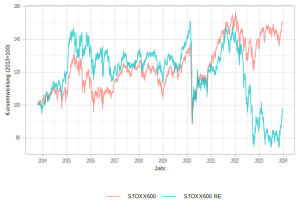
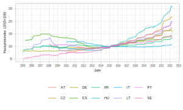
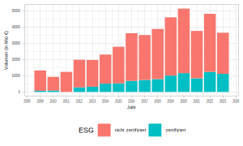

class: title-slide

```{r xaringan-themer, include=FALSE}
library(xaringanthemer)
style_xaringan(text_color = "#232461",inverse_text_color = "#FFFFFF",inverse_background_color = "#232461", title_slide_background_color = "#232461",header_background_color = "#232461",header_color = "#FFFFFF",header_h1_font_size = "32px",
  header_h2_font_size = "26px",link_color="#d84116",
  header_h3_font_size = "20px",text_slide_number_color = "#232461",text_slide_number_font_size = "0.5em")
```

```{r xaringanExtra, echo=FALSE}
xaringanExtra::use_progress_bar(color = "#d84116", location = "bottom")
xaringanExtra::use_xaringan_extra(c("tile_view","scribble","panelset","tachyons"))
xaringanExtra::style_panelset_tabs(font_family = "inherit")
#xaringanExtra::use_search(show_icon = TRUE)
#weitere: "share_again","animate_css", "webcam","freezeframe","clipboard","fit_screen","extra-styles" 
xaringanExtra::use_editable(expires = 1)
xaringanExtra::use_freezeframe(trigger = "hover")
```


```{r setup, include=FALSE}
options(htmltools.dir.version = FALSE)
library(fontawesome)
source(xfun::from_root("lit","helper.R"))
library(RefManageR)
BibOptions(check.entries = FALSE, 
           bib.style = "authoryear", 
           style = "markdown",
           dashed = TRUE)
file.name <- system.file("Bib", 
                         "my_bib.bib", 
                         package = "RefManageR")
bib <- ReadBib(xfun::from_root("lit","my_bib.bib"))
```


# Bestandsmanagement von Projektentwicklungsunternehmen

## Einordnung und aktuelle Trends

### HfWU Nürtingen-Geislingen am 18.12.2023 
<br>
<br>
<br>
<br>
<br>
<br>
<br>
<br>
### Prof. Dr. Jörg Schoder
<br>
.mycontacts[
`r fa('github')` @Schoder
`r fa('linkedin')` @jfschoder
]

---
layout: true

<div class="my-footer"></div>       

<div style="position: absolute;left:400px;bottom:10px;color:ISBAblue;font-size:9px">`r fa('creative-commons')``r rmarkdown::metadata$author`</div>


---
name: agenda
class: inverse, center, middle

# Das Programm

.blockquote[Teil 1: Finanzwirtschaftliche Perspektive]

.blockquote[Teil 2: Realwirtschaftliche Perspektive]

.blockquote[Teil 3: Diskussion]

---
name: icons
class: left


# Lernziele 


🛁
🎯

🎓
🅿️
⚖️
📝
📖
📂
🥇🥈🥉
📊
🚦
🔭
🔮


---
name: Teil1
class: inverse, center, middle

## Teil 1

## Blick zurück

.blockquote[Blick zurück: Wertentwicklung]

.blockquote[Projektentwicklungsunternehmen]

.blockquote[Bestandsmanagement]


---
name: stoxx600
class: left

# Öffentliche vs. Private Märkte

.panelset[
.panel[.panel-name[Öffentliche Märkte]
```{r}
#| label: fig-stoxx
#| echo: false
#| message: false
#| warning: false
#| out-width: '80%'
#| fig-align: 'center'
#| cache: true
#| fig-cap: "STOXX600 vs. STOXX600 RE"
#| fig-topcaption: true

```

.quellePanURL[Eigene Darstellung. Datenquelle: [investing.com](https://www.investing.com/indices/stoxx-europe-600-real-estate-price-historical-data).]

]
.panel[.panel-name[Private Märkte]
```{r}
#| label: hp-idxEU
#| echo: false
#| message: false
#| warning: false
#| out-width: '95%'
#| fig-align: 'center'
#| cache: true
#| fig-cap: "Wohnimmobilienpreise EU"
#| fig-topcaption: true

#source(xfun::from_root("R/houseprices.R"))
#ggplotly(p_EUselect)
```

.quellePanURL[Eigene Darstellung. Datenquelle: [Eurostat (2023)](https://ec.europa.eu/eurostat/web/hicp/database).]

]
]

???

* Macht einen stabileren Eindruck, aber natürlich nicht vergleichbar
* Hier private Märkte (Wohnimmobilienindex, Eurostat)
* entsprechend werden auch nur Wohnimmobilien betrachtet
* Bewertungszeitpunkte/-frequenz
* **Angebotspreise** in der zweiten Jahreshälfte in einigen Märkten, bspw. in Deutschland durchaus deutlich korrigiert (tw. -10%)
* **Ein wesentlicher Grund für die vergleichsweise stabilen Preise** ist das rückläufige Transaktionsvolumen


---
name: DW
class: left

# Immobilien- und Kapitalmarkt


```{r}
#| echo: false
#| fig-align: 'center'
#| out-width: '100%'
#| fig-cap: "DiPasquale-Wheaton-Modell"
#| fig-topcaption: true
knitr::include_graphics(xfun::from_root('img','DiPasqualeWheaton.png'))
```

.quelle[Eigene Darstellung.]

---
name: Volumen
class: left

# Rückläufige Immobilieninvestments in Europa


.panelset[
.panel[.panel-name[Volumen]
```{r vol22,echo=FALSE,out.width='100%',fig.align='center',cache=TRUE}
knitr::include_graphics('../img/Investmentvolumen_Europe_2022_(CBRE_2023).PNG')
```

<br>
.quellePanURL[Quelle: [CBRE (2023, S.2).](https://cbre.vo.llnwd.net/grgservices/secure/European%20Investment%20Snapshot%20Q4%202022.pdf?e=1685045014&h=3544b86bf005e57325ccfd886fab3246)]
]
.panel[.panel-name[Regionen und Sektoren]
<br>
<br>

```{r volsekreg,echo=FALSE,out.width='100%',fig.align='center',cache=TRUE}
knitr::include_graphics('../img/Investment_Volumes_Europe_SektorRegionen_(CBRE_2023).PNG')
```

<br>

.quellePanURL[Quelle: [CBRE (2023, S.1).](https://cbre.vo.llnwd.net/grgservices/secure/European%20Investment%20Snapshot%20Q4%202022.pdf?e=1685045014&h=3544b86bf005e57325ccfd886fab3246)]
]
.panel[.panel-name[Zeitvergleich]
```{r vol1122,echo=FALSE,out.width='85%',fig.align='center',cache=TRUE}
knitr::include_graphics('../img/Investment_Volumes_Europe_2011-2022_(CBRE_2023).png')
```

<br>
.quellePanURL[Quelle: [CBRE (2023, S.2).](https://cbre.vo.llnwd.net/grgservices/secure/European%20Investment%20Snapshot%20Q4%202022.pdf?e=1685045014&h=3544b86bf005e57325ccfd886fab3246)]
]
]


???


* Die folgenden Zahlen von CBRE 2023 zeigen ein durchaus heterogenes Bild,
  * sowohl sektoral
  * als auch regional
  
* Insgesamt Rückgang des Investmentvolumens
  * um 18% auf knapp über 300 Milliarden (von 371 Milliarden 2021).
  * besonders starker Einbruch im 4. Quartal (-58% zum Vorjahresquartal)
  * Wobei Q4-2021 einen absoluten Rekord aufstellte (mit 149Mrd.)
  
* NEXT PANEL
* Aber: Folientitel zu pauschal. Sektoral und Regional unterschiedliche Entwicklung:
* **Nach Sektoren**
  * Entgegen der landläufigen Meinung im deutschsprachigen Raum, waren 2023 die Investitionen im Bereich der **Handelsimmobilien** robuster als in anderen Assetklassen bzw. konnten sogar zulegen (+20%)
  * Stärkster Rückgang bei **Wohnimmobilien (-46%)**

* **Nach Regionen**
    * Steigerung der Investitionsvolumina in Südeuropa (Spanien +38%; Portugal +13%; Italien +12%)
  * positivste Entwicklung in Belgien (+109%), allerdings mit Sondereffekt (Transaktion eines großen Büroimmobilienportfolios)
  * Die **Top-3 Märkte nach Volumina** bleiben aber **UK, Deutschland und Frankreich** mit zusammen 171 Mrd. Euro bzw. **56% des Gesamtvolumens** in Europa.
  * Besonders stark in Südeuropa auch: **Studentisches Wohnen** und Gesundheitsimmobilien (Hintergrund: Junge Menschen waren traditionell lange zu Hause, verlassen aber immer häufiger das Elternhaus um in einer anderen Stadt zu studieren)
  
* NEXT PANEL
* Zeitlicher Verlauf zeigt, dass die Volumina  immer noch im Bereich der Jahre 2015-2021 lagen. 
* Rückgang 2022 -18%
* Allerdings wie erwähnt regional deutliche Unterschiede:
  * D: -42% (gesamt), bei Gewerbeimmobilien sogar  75% nach Zahlen von EY (2023)


---
name: Bilanz
class: left

# Bilanzielle Perspektive Projektentwicklungsunternehmen

```{r}
#| echo: false
#| fig-align: 'center'
#| out-width: '100%'
knitr::include_graphics(xfun::from_root('img','Bilanz.png'))
```
.quelle[Eigene Darstellung.]

--

⚖️ Finanzielles Gleichgewicht

--
* Asset and Liability Management (ALM)
* Finanzmanagement
* Risikomanagement
* Asset-Management


???

* Konsequenz für Projektentwickler?

* Geringere Nachfrage drückt auf mögliche Verkaufserlöse laufender Projektentwicklungen.

Der Gewinn liegt im Einkauf? 

* Damit kommen Geschäftsmodelle von mehreren Seiten unter Druck:
  * Steigende Zinsen
  * Zumindest 2022 gestiegene Baukosten (Anstieg zwar abgeschwächt, aber noch erhöhtes Niveau)
  * Geringere Verkaufserlöse

* Kalkulation geht in den meisten Fällen nicht mehr auf. Excel-Tabellen stimmen nicht mehr. Was tun?

* Finanzmanagement und Going-Concern

* Dreifache Bilanzkongruenz
  * Summarisch
  * Fristigkeit
  * Risikoadjustierung

* Quizfrage: Wo bilanzieren Developer Ihren Bestand?
  * Es kommt darauf an:
    * Absicht zu halten (Investor-Developer): Anlagevermögen
    * Absicht zu verkaufen (Trading-Developer): Umlaufvermögen (Vorräte)
    * Regelungen IAS 40 und IAS2


---
name: Dev-types
class: left

# Projektentwicklung und PE-Unternehmen

.panelset[
.panel[.panel-name[Definition]
.blockquote[
Durch Projektentwicklungen (im weiteren Sinne)
sind die Faktoren Standort, Projektidee und Kapital
so miteinander zu kombinieren, dass einzelwirtschaftlich
wettbewerbsfähige, Arbeitsplatz schaffende
und sichernde sowie gesamtwirtschaftlich
sozial- und umweltverträgliche Immobilienobjekte
geschaffen und dauerhaft rentabel genutzt werden
können

.tr[
`r Citet(bib,"diederichs_grundlagen_1994")`, S. 43.
]
]
]
.panel[.panel-name[Statisch]
```{r}
#| echo: false
#| fig-align: 'center'
#| out-width: '100%'
knitr::include_graphics(xfun::from_root('img','PE_statisch.png'))
```
.quellePanURL[Eigene Darstellung nach `r Citet(bib,"diederichs_grundlagen_1994")`, S. 46.]
]
.panel[.panel-name[Phasen]
```{r}
#| echo: false
#| fig-align: 'center'
#| out-width: '100%'
knitr::include_graphics(xfun::from_root('img','PE_Phasen.png'))
```

.quellePanURL[Eigene Darstellung.]
]
.panel[.panel-name[Typen]
```{r}
#| echo: false
#| fig-align: 'center'
#| out-width: '100%'
knitr::include_graphics(xfun::from_root('img','PE_Typen.png'))
```

.quellePanURL[Eigene Darstellung.]
]
]

???

* Trader-Developer: klassischer Projektentwickler

---
name: Bestandsmanagement
class: left

# Bestandsmanagement


???

Selbst wenn er als Trader Developer die von ihm entwickelte Immobilie nach ihrer Fertigstellung an einen Investor verkauft, berücksichtigt er heute die Bedürfnisse der Nutzungsphase viel stärker als früher. Häufig werden die Experten für die spätere Bewirtschaftung schon in der Konzeptionsphase in das Projektteam integriert. Dies betrifft nicht nur möglichst niedrige Bewirtschaftungskosten durch eine entsprechende Planung und Auswahl geeigneter Materialien, sondern auch größtmögliche Flexibilität der Grundrisse für später zu erwartende Anpassungsleistungen. Während Projektentwickler ihren Kunden früher eher selten Dienstleistungen für die Nutzungsphase angeboten haben (Facility Management, Wohnungseigentums-/WEG-Verwaltung, Betreiberleistungen usw.), haben sie heute die Vorteile der stabilen Einnahmen aus diesen Dienstleistungen entdeckt und ihre Geschäftsmodelle entsprechend erweitert. Falls der Projektentwickler selbst die Leistungen in der Nutzungsphase nicht anbietet, ist er dafür verantwortlich, dass die Übergabe des Projektes nach dessen Fertigstellung als Objekt an den zuständigen Objektmanager (oder auch Facility Manager, WEG-Verwalter usw.) rechtzeitig und reibungslos erfolgt. (Kinateder 2017, S. 530)


---
class: left

# Normstrategie Exit

```{r}
#| echo: false
knitr::include_url(xfun::from_root('lit','VONOVIA-SE_Zwischenmitteilung_Q3_2023-Gesamt.pdf'),height='550px')
```


---
name: ZIA-Index
class: left

# Wie ist die Stimmung?

```{r}
#| echo: false
knitr::include_url('https://zia-deutschland.de/project/zia-iw-immobilienstimmungsindex/',height = '560px')
``` 

.quelle[Quelle: [ZIA (2023)](https://zia-deutschland.de/project/zia-iw-immobilienstimmungsindex)]
`r NoCite(bib,"zia_zia-iw-immobilienstimmungsindex_2023")`


---
class: left

# Blick voraus

```{r}
#| echo: false
#| out-height: '90%'
knitr::include_graphics('https://www.iwkoeln.de/fileadmin/user_upload/Bilder/Slider/Immobilien/Grafik_Sonderfrage_Q4_2023.png')
```

.quelle[Quelle: [IW Köln (2023)](https://www.iwkoeln.de/presse/interaktive-grafiken/ralph-henger-michael-voigtlaender-ergebnisse-sonderumfrage-4-quartal-2023.html)]
`r NoCite(bib,"iw_zia-iw-immobilienstimmungsindex_2023")`


---
class: left

# Ausblick bulwiengesa

<iframe width="1020" height="550" src="https://www.youtube.com/embed/tmR5HmKibRo?si=BMe96fRpfMdoIt9l" title="YouTube video player" frameborder="0" allow="accelerometer; autoplay; clipboard-write; encrypted-media; gyroscope; picture-in-picture; web-share" allowfullscreen></iframe>

???

* Büroflächenleerstand auch perspektivisch höher (?)
* aktuell: hohe Untervermietungsquote


---
name: UBM-CZ
class: left

# Fallstudie: UBM Development

.panelset[
.panel[.panel-name[Verkauf]
```{r}
#| echo: false
knitr::include_url('https://www.ubm-development.com/de/presse/ubm-verkauft-liegenschaft-in-tschechien-um-e-11-mio',height='520px')
```
]
.panel[.panel-name[Neukonzeption]
```{r}
#| echo: false
knitr::include_url('https://www.skylineatlas.de/timber-pioneer/',height='520px')
```

]
]


???

* UBM. Bis zur Pandemie Schwerpunkt auf Hotelentwicklungen. Fertige Immobilien gingen dann an eigene Betreibergesellschaft (Betreiber von Markenhotels, bspw. Holiday Inn Express).

* Im Zuge der Corona-Pandemie hatte UBM eine Umplanung sämtlicher noch nicht in den Bau gegangener Hotelprojekte beschlossen.
* Timber Pioneer FFM: Auf dem Grundstück war ursprünglich ein konventioneller Hotelbau vorgesehen. 


---
name: 5prozStudie
class: left

# Leichte Renditeanstiege bei Core-Immobilien in D

## Bulwiengesa CoreMatrix
```{r coreMatrix,echo=FALSE,out.width='100%',fig.align='center',cache=TRUE}
knitr::include_graphics('../img/Core-Matrix_(bulwien_gesa_2022)_S2.PNG')
```

.quelle[Quelle: [bulwiengesa (2022, S. 2)](https://bulwiengesa.de/sites/default/files/2022-09/die-5-prozent-studie-2022-dt.pdf).]

???

* Insgesamt haben rückläufige Preise und in der Tendenz steigende Mieten zu einem Anstieg der Renditen geführt. 
  * bspw. knapp 0,5 Prozentpunkte bei Wohnimmobilien in deutschen A-Städten
* Bulwien-Gesa 5%-Studie
* IRR-Ermittlung in Verbindung mit Monte-Carlo-Simulation
  * Paremeter für die verschiedenen Asset-Klassen
  * Basiswerte und Spannweiten u. a. für die Variablengruppen 
    * Mietzins, 
    * Leerstand und 
    * Objekt- und Betriebskosten 
  * Die aus der Cashflow-Berechnung hervorgegangene interne Verzinsung des Investments als Prognosewert bzw. IRR-Basiswert

* **Core- vs. Non-Core-Investoren** Einteilung auf rein statistischer Ebene!
  * Ausgehend von der Annahme, dass Core-Investoren
weniger Risiko eingehen und dabei geringere Renditen akzeptieren und Non-Core-Investoren weniger risikoavers sind und höhere Renditeziele haben, wurde in der Studie der **Korridor** für Core- und Non-Core-Investoren abgesteckt.
  * Ergebnisse einer **Monte-Carlo-Simultione der IRRs im 2. und 3. Quartile** als CORE.
  * Der übrige Bereich – **ab einer erzielbaren Verzinsung von 6,49 % IRR Basiswert** als Raum für **Non-Core**-Investoren angesehen.

* IRR
  * Nachteil: Wiederanlageprämisse
  * Vorteil: dynamisches Renditekonzept


---
name: Teil2
class: inverse, center, middle

## Teil 2

## Blick voraus

.blockquote[Einflussfaktoren Immobilienallokation]

.blockquote[Deep Dive: Finanzierungsumfeld und Investmentstrategien]


---
name: JLL-quote
class: left


# Wo kommen wir her?

.blockquote[
In der Niedrigzinsphase fand nahezu jedes Produkt, das auf den Markt kam, schnell zahlreiche Bieter. Die Risikoklassen verwischten, Core-Plus-Produkte gingen mit einem Zwinkern als Core durch, da Investoren davon ausgingen, dass der Wert in jedem Fall steige – wenn man das Asset nur im Bestand hat.
.tr[
[Jones Lang Lasalle (2023)](https://www.jll.de/de/trends-and-insights/investoren/damit-core-auch-core-bleiben-kann)
]
`r NoCite(bib,"jones_lang_lasalle_damit_2023")`
]


---
name: financing
class: left

# Finanzierungsformen und -bedarf

.panelset[
.panel[.panel-name[Kreditzinsen]
```{r creditrates,echo=FALSE,out.width='85%',fig.align='center',cache=TRUE}
knitr::include_graphics('../img/Immo_vs_Unternehmenskredite.svg')
```

.quellePanURL[Eigene Darstellung. Datenquelle: [EZB (2023)](https://sdw.ecb.europa.eu/home.do).]


]
.panel[.panel-name[Anteil variabler Verzinsung]

```{r varZins,echo=FALSE,out.width='85%',fig.align='center',cache=TRUE}
knitr::include_graphics('../img/Anteil_VariableZinsen.svg')
```

.quellePanURL[Eigene Darstellung. Datenquelle: [EZB (2023)](https://sdw.ecb.europa.eu/home.do).]
]
.panel[.panel-name[Refinanzierungslücke]

```{r fundgap,echo=FALSE,out.width='90%',fig.align='center',cache=TRUE}
knitr::include_graphics('../img/Funding_Gap_2023-2025_(AEW_2022).png')
```

.quellePanURL[Quelle: [AEW (2022, S. 8)](https://www.aew.com/site-assets/documents/2022_Sep_AEW-Research-Report_DRAFT21_FINAL.pdf).]
]
]


???

* Panel 1: Deutlicher Anstieg der Finanzierungskosten
* Panel 2: Zunahme der Finanzierungen mit variabler Verzinsung. Hoffen auf bald sinkende Zinsen im letzten Jahr durchaus verbreitet
* Panel 3: Refinanzierunglücke, Schätzung AEW (Boston)
  * für UK, D und Frankreich ca. 24 Mrd. bis 2025
  * Deutlich geringer als in der Finanzkrise, damals 70 Mrd.
  * entspricht etwa 9% der Transaktionsvolumina in den letzten 3 Jahren
* Based on the experience from the global financial crisis, this **relatively modest gap**   * will likely be **bridged by a combination of**
    * equity top-ups, 
    * junior debt plugs, 
    * senior loan extensions & restructurings, 
    * loan write-downs, and 
    * discounted loan sales.


---
name: Trends
class: inverse, center, middle

## Teil 3

## Umfeld- und Marktanalyse

.blockquote[Makroökonomisches Umfeld]

.blockquote[Nachhaltigkeit]

.blockquote[Digitalisierung]


---
name: concerns
class: left

# Megatrends im Immobilieninvestment (D)

<br>
```{r megatrends,echo=FALSE,out.width='100%',fig.align='center'}
knitr::include_graphics('../img/Megatrends_(EY_2023)_S29.png')
```

.quelle[Quelle: [EY (2023), S. 29](https://assets.ey.com/content/dam/ey-sites/ey-com/de_de/noindex/ey-de-trendbarometer-immobilien-investmentmarkt-2023.pdf?mkt_tok=NTIwLVJYUC0wMDMAAAGL81UnByZp5cIYQEofBummTcYfqRH_8IvfrSNbVSwAhQk2NgVTfw9qJsGH7fjJrKU3mQ_R4WYBVTvcr6ypweAR3Ki1uZwUrpg5MmW9bXZ1EJbmrRURzw)]


???

* aus EY Trendbarometer Immobilien-Investmentmarkt 2023


---
name: inf_gif
class: left

# Entspannung an der Inflationsfront?

```{r hvpi_gif,echo=FALSE,message=FALSE,warning=FALSE,out.width='100%',fig.align='center',cache=TRUE}
knitr::include_graphics('../img/hvpi_core_noloop.gif')
```

.quelle[Eigene Darstellung. Datenquelle: [Eurostat (2023)](https://ec.europa.eu/eurostat/web/hicp/database).]

???

* Entspannung nur auf den ersten Blick. Kerninflation nach wie vor sehr hoch (um 5%)

---
name: BlanchSumm
class: left

# Ende der säkularen Stagnation?

<iframe width="1150" height="520" src="https://www.youtube.com/embed/df5csVeBcrQ?start=3607" title="YouTube video player" frameborder="0" allow="accelerometer; autoplay; clipboard-write; encrypted-media; gyroscope; picture-in-picture; web-share" allowfullscreen></iframe>


???

* Summers und Blanchard 2017 (?) Säkulare Stagnation. Liquiditätsfalle und zero lower bound
* Nachdem sich die beiden lange Jahre einig waren, schätzen sie die zukünftige Entwicklung nun anders ein:
  * Blanchard betont eher die Bedeutung des Save-Asset-Demand
  * Summers betont stärker das Verhältnis von Ersparnis und Investition
  
* Blanchard glaubt eher an eine Rückkehr in die Vor-Covid-Welt, was die Realzinsen angeht und damit eine dynamisch ineffiziente Situation $r<g$, die aus seiner Sicht für eine aktivere Rolle der Fiskalpolitik spricht.
* Summers vermutet strukturelle Änderungen und dauerhaft höhere Realzinsen, oberhalb der Wachstumsrate und führt dafür folgende Gründe an, die beide im Video diskutieren:
  * Geopolitische Veränderungen und Re-Shoring/Near-Shoring aus politischen Gründen
  * Demografischer Wandel
  * höherer Investitionsbedarf (bspw. Grüne Infrastruktur)


---
name: riskpremia
class: left

# Renditeentwicklung von Anleihen vs. Immobilien (D)

<br>
<br>
```{r riskpr,echo=FALSE,out.width='100%',fig.align='center',cache=TRUE}
knitr::include_graphics('../img/Renditeabstand_RE-Bonds_(Colliers_2023).png')

```

.quelle[Quelle: [Colliers (2023).](https://citysurvey.colliers.de/makrookonomisches-umfeld/#Makrooekonomisches_Umfeld_2.2)]


---
name: demografie
class: left

# Demografische Entwicklung

```{r,echo=FALSE,out.width='100%',fig.align='center'}
knitr::include_graphics('../img/Bev_pyr_D.svg')
```

.quelle[Eigene Darstellung, Datenquelle: [Destatis (2023)](https://service.destatis.de/bevoelkerungspyramide/index.html).]


---
name: digit
class: left

# Digitalisierung ("on Purpose")

```{r,echo=FALSE,out.width='100%',fig.align='center'}
knitr::include_graphics('../img/Unruh_Kiron_(MIT_2018).png')
```

.quelle[Quelle: [Unruh/Kiron (2018)](https://sloanreview.mit.edu/article/the-convergence-of-digitalization-and-sustainability/).]


???

* Zum Thema Digitalisierung ließe sich allein ein ganzes Semester füllen, deshalb hier nur kurz und schon im Kontext mit dem nächsten Megatrend Nachhaltigkeit
* Unruh/Kiron: Digitalisierung kann Beitrag zur Nachhaltigkeit leisten
* passt zur Purpose-Diskussion im Bereich Strategy

* Konkrete Potentiale in der Immobilienwirtschaft
  * BIM, digitale Datenräume
  * smart meter und unstrukturierte Daten
  * Automatisierung - auf allen Managementebenen


---
name: greendeal
class: left

# (Energie-)Politische Rahmenbedingungen in Europa

.panelset[
.panel[.panel-name[Green Deal und ETS2]
```{r,echo=FALSE,out.width='90%',fig.align='center'}
knitr::include_graphics('../img/ets2_(umweltbundesamt).png')
```
.quellePanURL[Quelle: [Umweltbundesamt (2021)](https://www.umweltbundesamt.de/sites/default/files/medien/1410/dokumente/2022_01_17_factsheet_ets_2.pdf).]

]
.panel[.panel-name[ETS Phase 1-3]
```{r,echo=FALSE,out.width='100%',fig.align='center'}

```
.quellePanURL[Eigene Darstellung. Datenquelle: ICE/Statista.]
]
.panel[.panel-name[ETS Phase 4]
```{r,echo=FALSE,out.width='100%',fig.align='center'}
knitr::include_url("https://ember-climate.org/data/data-tools/carbon-price-viewer/",height='480px')
```
.quellePanURL[Quelle: [ember-climate.org](https://ember-climate.org/data/data-tools/carbon-price-viewer/)]
]
]


???

* **Green Deal**

.blockquote[
"energy efficiency must be prioritised". Specifically for the building sector, accounting for around 40% of energy consumption, the announced ‘renovation wave’ and a recast of the Energy Performance of Buildings Directive (EPBD) aim to at least double the current renovation rates of 0.4–1.2% per year."
.tr[
— (EU Kommission, 2019), zitiert nach [Hummel et al](https://link.springer.com/article/10.1007/s12053-023-10097-6)
]
] 

* Ab 2024 sollen im Rahmen des ETS2 auch **Gebäude** und der **Verkehrssektor** in den (bereits bestehenden!) europäischen Emissionshandel (ETS) einbezogen werden.
  * ETS2 ersetzt dann letztlich die ESR (Effort Sharing Regulation), also die zwischenzeitlich verpflichtenden nationalen Emissionsziele (**grau gestrichelt**)
  * Erstmals sollen Mitgliedsstaaten für 2024 ein Reporting erstellen (fällig bis Mitte 2025): **Monitoring Reporting and Veryfying (MRV)**
  * bis 2026 eher softe Einphasung
  * Dann bis 2030 klar definierte Schritte der Reduzierung von Emissionsrechten
  * als Upstream Regulierung (d.h. nicht einzelne Haushalte müssen Emissionsrechte kaufen, sondern die "In-Verkehrsbringer")
* Erlöse fließen in den 
  * **Klimasozialfonds** (sozialer Ausgleich) und den
  * **Innovationsfonds** (Finanzierung von Green Investments!)
  

* Wie teuer wird das? Schätzung der EU-Kommission bei vorgesehener Mengenregulierung Preisniveauzwischen 48€/tCO2 und 80€/t CO2 ergeben in 2030.

* das schint eher optimistisch ist, wie ein Blick in den bestehenden **Emissionshandel** ETS zeigt

* Dieser trat 2005 in Kraft und stellt quasi eine Umsetzung des Kyotoprotokolls (von 1997) dar
  * seither wurden schrittweise mehr Sektoren integriert (bspw. neben Industrie seit 2013 auch Luftfahrtsektor)
  * und in mehreren Schritten die Menge der Emissionsrechte reduziert (seit 2021 befinden wir uns in Phase 4, der letzten Phase mit klar vorgegebenen Reduktionszielen)
  * Stabilisierung des Marktes bzw. CO2-Preises durch die **MSR** (Market Stability Reserve)


* History in detail

* Kyoto-Protokoll 1997: erstmals rechtlich verbindliche Ziele zur Emissionsreduktion
* Green Paper EU 2000: Erste Ideen zu einem europ. Emissionshandel
* EU ETS-Richtlinie zum Emissionshandel: 
* Inkrafttreten ETS 2005 (vgl. [EU-Kommission](https://climate.ec.europa.eu/eu-action/eu-emissions-trading-system-eu-ets/development-eu-ets-2005-2020_en)):
  * Phase 1 (2005-2007): Pilotphase. Nur **Kraftwerke und energieintensive Industrien**. Emissionsrechte fast vollständig kostenlos, geringe Strafen (40€ pro Tonne). Erstmals CO$_2$-Preis
  * Phase 2 (2008-2012): Einhaltung Kyotoprotokoll, Reduzierung Emissionsrechte um 6,5%, davon 90% als kostenlose Emisionsrechte, Strafe 100€ pro Tonne. Einbeziehung **Luftfahrtsektor**; Beitritt Liechtenstein, Island und Norwegen.
  * Phase 3 (2013-2020): EU-weit gedeckelte Emissionsrechte statt bisher nationaler Obergrenzen. Auktion als Standardlösung (vorher wahlweise), **Einbeziehung weiterer Sektoren und Gas**
  * Phase 4 (2021-2030): ETS als zentraler Baustein zum seit 2021 offiziellen Reduktionsziel (55% bis 2030). 
    * Weiterhin kostenlose Emissionsrechte für (100% der Emissionen der) Sektoren mit dem höchsten Abwanderungsrisiko 
    * Ansonsten Ausphasung kostenloser Emissionsrechte von 2026 (max. 30%) auf 0 in 2030
    * Low-Carbon Finanzierung (Innovations- und Modernisierungsfonds)


---
name: TaxSFDR
class: left

# EU-Verordnungen 2019/2088 und 2020/852

```{r,echo=FALSE,out.width='100%',fig.align='center'}
knitr::include_graphics('../img/Anteil_SFDR_Typen.svg')
```

.quelle[Eigene Darstellung. Datenquelle: [Morningstar (2023)](https://www.morningstar.de/de/news/231440/sfdr-verm%C3%B6gen-von-artikel-9-fonds-nach-welle-von-herabstufungen-fast-halbiert.aspx).]

???

* SFDR: EU Sustainable Finance Disclosure Regulation 
* Deutsch: EU-Verordnung 2019/2088: Offenlegungsverordnung
  *  nachhaltigkeitsbezogene Offenlegungspflichten im Finanzdienstleistungssektor
  * besondere Bedeutung für die Praxis: Transparenzartikel
    * Artikel 6
        * Nachhaltigkeits*risiken* müssen offengelegt werden (oder: Begründung warum als nicht notwendig erachtet)
        * Einbeziehung in Investitions-/Beratungsentscheidungen
        * Bewertung Renditeeffekte
        
    * **Artikel 8** (hellgrün)
      * Bwerbung ökologischer/sozialer Merkmale
      * Zielunternehmen wenden gute Governance an
    
    * **Artikel 9** (dunkelgrün)
      * sog. Impact Funds
      * Anstreben einer nachhaltigen Investition, besonders: CO2-Reduktion
      
  * In Kraft seit März 2021
  * Seither müssen KAGs Informationen über ESG-Praktiken, *Nachhaltigkeitsrisiken* und *Nachhaltigkeitsfaktoren* (-auswirkungen) der Fonds offenlegen
  
* EU-Verordnung 2020/852: Taxonomieverordnung
  * Definition nachhaltiger Investitionen
  * Eine ökologisch nachhaltige Investition ist eine Investition in eine oder mehrere
Wirtschaftstätigkeiten, die gemäß der TaxonomieVO als ökologisch nachhaltig
gelten

* Interessant: 
   * Zwischen 09/2022 und 02/2023 wurden 307 Fonds von Artikel 9 auf Artikel 8 herabgestuft
   * Hintergrund: Im Vorfeld der neuen Offenlegungsregelung und nach Klarstellung der Aufsichtsbehörden, dass Fonds nach *Artikel 9* **nur in nachhaltige Anlagen** investieren dürfen, haben viele Fondsmanager die **Klassifizierung** ihrer Fonds **überprüft** und **Artikel 9-Produkte auf Artikel 8 herabgestuft**. 
  


---
name: GreenInvest
class: left

# Investitionen in ESG-konforme Gebäude (D)

.panelset[
.panel[.panel-name[Volumina]

```{r ESG-vol,echo=FALSE,out.width='100%',fig.align='center'}

```

.quellePanURL[Eigene Darstellung, Datenquelle: [BNP Paribas RE](https://www.realestate.bnpparibas.de/blog/esg/green-buildings-nachhaltiges-bauen-auf-dem-vormarsch).]

]
.panel[.panel-name[Nutzungsart]

```{r ESG-use,echo=FALSE,out.width='100%',fig.align='center'}
knitr::include_graphics('../img/Sector_ESG.svg')
```

.quellePanURL[Eigene Darstellung, Datenquelle: [BNP Paribas RE](https://www.realestate.bnpparibas.de/blog/esg/green-buildings-nachhaltiges-bauen-auf-dem-vormarsch).]
]

.panel[.panel-name[Käufergruppen]

```{r ESG-buyers,echo=FALSE,out.width='100%',fig.align='center'}
knitr::include_graphics('../img/Buyers_ESG.svg')
```

.quellePanURL[Eigene Darstellung, Datenquelle: [BNP Paribas RE](https://www.realestate.bnpparibas.de/blog/esg/green-buildings-nachhaltiges-bauen-auf-dem-vormarsch).]

]
]

???

* Lag der relative Anteil der grünen Investments an den Einzeldeals 2021 noch bei 25,7 %, stieg er 2022 bereits auf 30,6 %.

* Anteil des Investitionsvolumens verschiedener Käufergruppen, der in grüne Investments geht. Bspw. waren über 72% der Investitionen von Versicherungen grüne Investments.


---
name: sustrends
class: left

# Trends: Nachhaltiges Bauen und Quartiersentwicklung

.panelset[
.panel[.panel-name[RAG Headquarter]
```{r,echo=FALSE,out.width='77%',fig.align='center'}
knitr::include_graphics('../img/RAG_c2c_(bundesstiftung_baukultur).jpg')
```
<br>
.quellePanURL[Bildquelle: [bundesstiftung-baukultur.de](https://www.bundesstiftung-baukultur.de/baukultur-bundesweit/beispiele-guter-baukultur/detail/rag-stiftung-rag-ag).]
]
.panel[.panel-name[Telekom Redevelopment]
```{r,echo=FALSE,out.width='81%',fig.align='center'}
knitr::include_graphics('../img/telekom_KN_(suedkurier).png')
```
<br>
.quellePanURL[Bildquelle: [Südkurier (22.10.2022)](https://www.suedkurier.de/region/kreis-konstanz/konstanz/verzoegert-sich-der-umbau-des-telekom-hochhauses-und-wie-teuer-wird-s;art372448,11331031)]
]
.panel[.panel-name[Urban Farming]
```{r,echo=FALSE,out.width='77%',fig.align='center'}
knitr::include_graphics('../img/urban_farming_(lemonde).png')
```
<br>
.quellePanURL[Bildquelle: [Le Monde (14.08.2019)](https://www.lemonde.fr/planete/article/2019/08/13/la-plus-grande-ferme-urbaine-d-europe-ouvrira-au-printemps-2020-a-paris_5499051_3244.html).]
]
.panel[.panel-name[Nachhaltige Quartiere]
```{r,echo=FALSE,out.width='87%',fig.align='center'}

```
<br>
.quellePanURL[Bildquelle: [Fraunhofer Umsicht (22.10.2022)](https://www.umsicht.fraunhofer.de/de/forschung-fuer-den-markt/nachhaltige-gebaeude-und-quartiersentwicklung.html)]
]
]


???

* Verwaltungsgebäude der RAG-Stiftung in Essen 
  * als erstes Projekt in Deutschland, das nach dem **Cradle to Cradle**-Konzept realisiert wurde. 
  * Einsatz einer **sortenrein trennbaren Aluminium-Glas-Fassade** (nichts verklebt, sondern ausschließlich gesteckt und geschraubt)

* 100-Meter-Holzhochhaus Winterthur (Fertigstellung 2026?) 
  * *Implenia* setzt das Projekt im Auftrag der Ina Invest Holding AG 
  * Wohnnutzung
  * **Rocket-Haus** derzeit das weltweit höchste in Planung befindliche Wohngebäude aus Holz in reiner **"timber structure"**
  * derzeit auch zahlreich Projekte in **"hybrid-timber"** (meist Stahlbeton-Fundamente und Aufzüge/Treppenhäuser, dann aufgeständert Holzbauweise)


* **Urban Farming**
  * Bild zeigt das weltweit größte Urban Farming-Projekt auf den Dächern der Messehallen der Expo Porte de Versailles 
    * insgesamt 14000qm, Bewirtschaftung durch 20 angestellte GärtnerInnen
    * angelegt als profitables Geschäftsmodell
    * Ziel: 1t Lebensmittel täglich, die regional vermarktet werden sollen
  * ein weiteres Projekt (mit 640qm deutlich kleiner) in Paris auf einem Bürogebäude der PNB Parbas (Anbau von Obst, Gemüse und Kräutern durch Mitarbeitende in Teams)

* Quartiersentwicklung:  
  * Ansatz ist grundsätzlich, Quartiere als Ganzes zu betrachten. 
  * Im städtischen Raum greifen die unterschiedlichsten Funktionen wie in einem Puzzle ineinander:
    * Bevölkerung, Energiesysteme, Gebäude, Verkehr, städtisches Grün und Emissionen.


---
name: Fazit
class: left

# Key Learnings

* Starke Preiskorrekturen bei öffentlich gehandelten Immobiliengesellschaften
--

* Abwartende Haltung auf privaten Märkten
  * Transaktionsvolumina deutlich rückläufig, aber noch auf hohem Niveau
  * Vermehrt Korrekturen bei Angebotspreisen

--
* Deutliche Bremsspuren in der Projektentwicklung
  * Baukosten und geringe Risikoprämien
  * Künftig verstärkt Entwicklung im Bestand (GHG Protokoll)

--
* Regional und sektoral heterogene Entwicklung
  * Südeuropa und Handelsimmoblien robuster
  * Mittel-/Nordeuropa und Büroimmobilien schwächer

--
* Neues Preisniveau muss noch gefunden werden. Bedeutsam dabei:
  * Makroökonomische Entwicklung und demografischer Wandel
  * Nachhaltigkeitsaspekte und politische Risiken

--
* Nachhaltiges Investieren als intakter Trend, gerade in der Immobilienbranche
  * Zertifizierungen als Herausforderung für Investoren
  * Digitalisierung und Nachhaltigkeit: großes Potenzial für Synergien
  


???

* Zur Projektentwicklung konnte ich mangels Zeit nichts sagen, aber zumindest an dieser Stelle will ich noch ein paar entscheidende Aspekte im Zusammenhang mit der Projektentwicklung nennen.


* **NEUES Preisniveau**
  * Stützende Faktoren: bisher stabile Nachfrage nach Flächen (Realwirtschaft)
  * Nachhaltigkeitsaspekte und politische Risiken
    * Einerseits sollte Investitionsbedarf stützen
    * Andererseits bisher wenig Planbarkeit bspw. ETS2
    * Gefahr von stranded Assets?

---
name: EndHanks
class: center

background-size: 75%
background-image: url(https://media.giphy.com/media/KJ1f5iTl4Oo7u/giphy.gif)


---
name: Teil 4
class: inverse, middle, center

## Teil 4

## Aktuelle Praxisthemen und Projektideen


---
name: gresb
class: left

# Nachhaltigkeitszertifizierung


.panelset[
.panel[.panel-name[GRESB]
<br>
```{r gresb,echo=FALSE,out.width='100%',fig.align='center'}
knitr::include_graphics('../img/gresb_website.png')
```
.quellePanURL[Bildquelle: [gresb.com](https://www.gresb.com/nl-en/).]

]
.panel[.panel-name[WELL]
<br>
```{r well,echo=FALSE,out.width='100%',fig.align='center'}
knitr::include_graphics('../img/well_website.png')
```
.quellePanURL[Bildquelle: [wellcertified.com](https://www.wellcertified.com/).]

]
]

???

* GRESB
  * Global Real Estate Sustainability Benchmark (Grundsätzlich ESG)
  * Stellt die Praxis von Investmentmanagern häufig vor Probleme, weil die Anforderungen sich häufig (jährlich) ändern.
  * bspw. fehlende Standards für die Mieterbefragungen
  *CS arbeitet hier bspw. mit POM+ zusammen

* WELL
  * Qualität der Gebäude für die Mitarbeiter (Fokus auf S aus ESG)
  * Bspw. Luftqualität, Licht, **Erreichbarkeit (GHG-Protocol)**


---
name: Buildage
class: left

# Altersstruktur von Wohngebäuden (Beispiel D)

```{r buildageD, echo=FALSE,out.width='100%',fig.align='center'}
knitr::include_graphics(xfun::from_root("img/BuildStock_Age_D.svg"))
```

.quelle[Eigene Darstellung. Datenbasis: [destatis (2020)](https://www.destatis.de/DE/Themen/Gesellschaft-Umwelt/Wohnen/Tabellen/wohneinheiten-nach-baujahr.html).]

???

* EU-Richtlinie über die Gesamtenergieeffizienz von Gebäuden (Energy Performance of Buildings Directive, EPBD)
* Aktuell plant die EU eine Novellierung der Energy performance of buildings directive (EBPD), die noch dieses Jahr finalisiert werden soll. Noch fehlen Ausformulierungen der technischen Anforderungen zu den übrigen vier von sechs Umweltzielen im Rahmen der Taxonomieverordnung; was möglicherweise zu einer Verschiebung auf Ende 2023 bzw. Anfang 2024 führt. Besonders das vierte Umweltziel **"Übergang zu einer Kreislaufwirtschaft" wird Projektentwickler und Bauunternehmen vor neue**, besonders anspruchsvolle **Herausforderungen stellen**. [Colliers (2023)](https://citysurvey.colliers.de/makrookonomisches-umfeld/)


* Ein erster Meilenstein war die EPBD 2010: verpflichtung der Mitgliedsländer zur Setzung von Mindeststandards
  * Forschung seither vielfach auf Basis von **Normgebäuden und Einzelfallanalysen**. [Hummel et al. (2023)](): "Often, a remarkable number of refurbishment and heating system change options are also considered. At the same time, **taking into account resource restrictions as well as interactions in the entire energy system is not possible at this analysis level**. Therefore, it is not possible to upscale the results of the cost-optimality calculations for single buildings or building types to the national or EU level to understand cost-optimal saving levels (vgl. [Hummel et al](https://link.springer.com/article/10.1007/s12053-023-10097-6)).
  * Studien auf **Stadt- oder Regionalebene** mit Einbeziehung von **Fernwärmenetzen** (disrict heating)
  * "Henning and Palzer (2014) developed the REMod-D model for optimising energy systems at the national level. [..] [T]hey conclude that ambitious levels of heat savings in building retrofitting will be needed to reach 100% renewable energy in heat and electricity use, considering that full exploitation of technical resource potentials will most probably not be possible."


---
name: affordability
class: left

# Finanzierung und Förderung nachhaltiger Immobilien

* Private und institutionelle Investoren

--

* Entwicklung eines integrierten Tools

--

  * Kosten-Nutzen-Analysen von Sanierungsmaßnahmen

--
  
  * Priorisierung von Maßnahmen unter Berücksichtigung der...

--
      * ...Finanzierbarkeit und der
--
      * ...Fördermöglichkeiten (national bzw. EU)


---
name: WirtschaftlichkeitSanierung
class: left

# Wirtschaftlichkeit von Sanierungen

.panelset[
.panel[.panel-name[BAU]
```{r BPIE1,echo=FALSE,out.width='80%',fig.align='center'}
knitr::include_graphics('../img/EnergySavingCostCurve_BAU_(BPIE_2015_S7).png')
```

.quellePanURL[[BPIE (2015).](http://bpie.eu/wp-content/uploads/2016/02/BPIE_Renovating-Germany-s-Building-Stock-_EN_09.pdf)]
]

.panel[.panel-name[Subventionierung]
```{r BPIE2,echo=FALSE,out.width='70%',fig.align='center'}
knitr::include_graphics('../img/EnergySavingCostCurve_HiSub_(BPIE_2015_S8).png')
```
.quellePanURL[[BPIE (2015).](http://bpie.eu/wp-content/uploads/2016/02/BPIE_Renovating-Germany-s-Building-Stock-_EN_09.pdf)]]
.panel[.panel-name[Best Case]
```{r BPIE3,echo=FALSE,out.width='70%',fig.align='center'}
knitr::include_graphics('../img/EnergySavingCostCurve_Best_(BPIE_2015_S9).png')
```
.quellePanURL[[BPIE (2015).](http://bpie.eu/wp-content/uploads/2016/02/BPIE_Renovating-Germany-s-Building-Stock-_EN_09.pdf)]
]

]

???

* Best Case mit Erhöhung Subventionen ggb. BAU (10-25%) auf 20-40% (=Sub-Szenario)
* Im Best Case zudem noch günstigere Finanzierungsbedingungen (2% statt 4% in Bau und Seb-Szenario) sowie halbierten Transaktionskosten und höheren Kostensenkungen im Bau

---
class: left

# Quellenverzeichnis

.ref-slide[
```{r, results='asis', echo=FALSE, warning=FALSE}
PrintBibliography(bib)
```
]